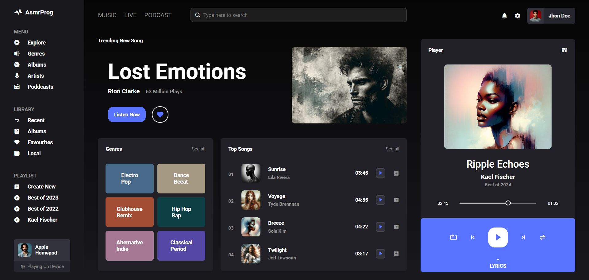

# Responsive Music Website Design

In this tutorial ([Open in Youtube](https://youtu.be/Fwyo1AqvzM4)),  I'm going to show you how to use modern HTML and CSS to create a completely responsive Music App Design with awesome color theme. We'll be using CSS Flexbox, Media queries for our responsive design and CSS  transition for some cool animation effects. Also we have a Sidebar for it! This project contains Sidebar, Music Player, Header, Genres and Top Musics sections!

# Screenshot
Here we have project screenshot :

